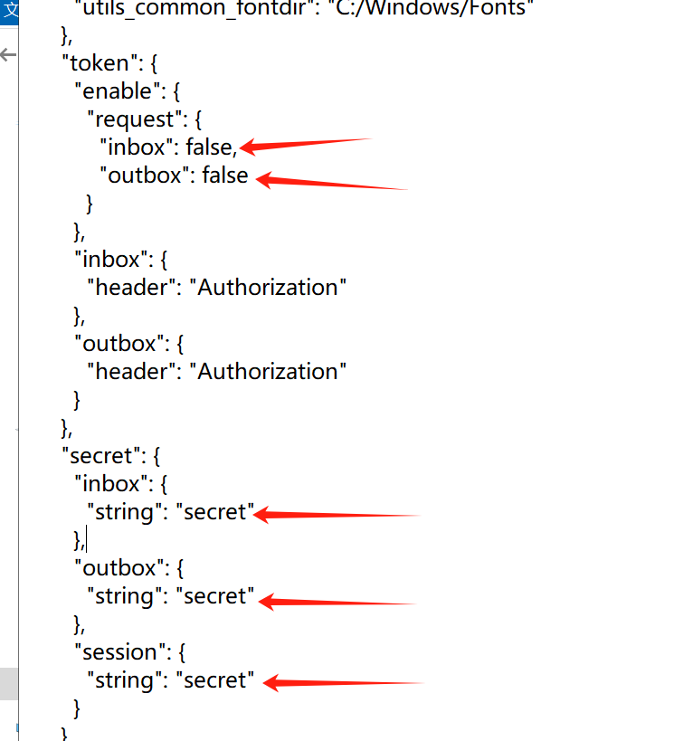
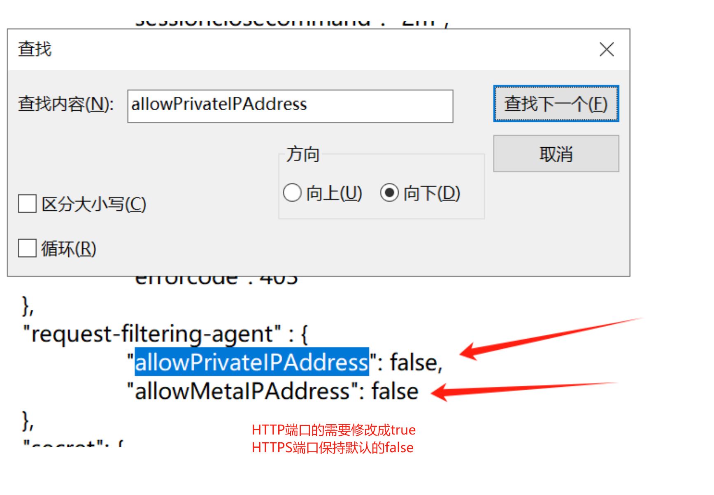

# 設定說明

四個步驟讓你快速擁有可用 https 訪問的可道雲，還可以顯上編輯 office 文件 !!

簡單說明該專案用途 : 可道雲在台灣還不流行的樣子，我只是覺得他的桌面很漂亮，整個用法跟某間 NAS 很像，所以才去努力研究後把他部署上來。
原本遇到了很多關於反向代理轉伺服器上容器問題，研究了幾個禮拜有吧，後來仔細看過他們說明書後才恍然大悟，原來我是我想太多，其實最快的也還算是安全的做法就是直接把容器分離，每個服務都一個容器，然後可道雲跟onlyoffice就直接啟動在特定PORT號上，然後用反向代理直接代理過去，https 代理 http，然後把啟動在特定 PORT 號上的可道雲以及onlyoffice設定成只能伺服器內訪問，這樣就還算安全，然後對外的其實只有 8443 443 80 這三個 port，不過我自己還有個設定有漏作就是去設定 onlyoffice 只允許特定域名訪問，原因是我還沒決定好域名，所以就還沒說明這部分，但是這有個風險會讓我的 onlyoffice 服務被他人所用，所以後面我一定會更新設定方法，不會讓他露在外面的。 

## 步驟 1

### 依照下列指令啟動 kodbox
1. 下載整個專案後拷貝整個資料夾到您的伺服器，可以隨意位置，可盡量在 /etc 下方，如無 root 權限則在自己/home/yourname/ 的資料夾下方。

2. 先修改 kodcloud/kodbox/dn.env 裡面的 MYSQL_PASSWORD
```
MYSQL_PASSWORD=YOUR_DB_PASSWORD #改這裡
MYSQL_DATABASE=kodbox
MYSQL_USER=kodbox
```

3. 修改 kodcloud/kodbox/docker-compose.yml 的 - MYSQL_ROOT_PASSWORD=YOUR_DB_PASSWORD
注意(1) : 密碼要跟第 2 點改的一樣蛤 !! 不要兩邊不一樣。
注意(2) : 密碼盡量複雜，可以用特殊字元，12 碼 ~ 16 碼安全度較佳。

4. 依序下達指令啟動kodbox
```
cd kodcloud/kodbox

sudo docker-compos up -d  #如有 root 權限則不用 sudo
```
5. 等待啟動完成，確認 docker logs 有無錯誤，或是直接 docker ps 確認容器狀況。

## 步驟 2
### 快速啟動 kodoffice(即 onlyoffice 可道雲專用版) 於 8001 對kodoffice內 80 
1. 啟動指令 :
```
sudo docker run -itd -p 8001:80 --name kodoffice --restart always kodcloud/kodoffice:7.4.1.1

# 更新官方 onlyoffice 啟動法
sudo docker run -itd -p 8001:80 --name onlyoffice --restart always -e JWT_ENABLED=false onlyoffice/documentserver:latest
```
2. 要注意 : 快起的方式會要等待 5 分鐘才會完全啟動，可利用 curl http://localhost:8001/web 指令確認有無成功返回 html 代碼。

3. 如果你後面打算先使用自簽憑證(即非付費憑證)，一定要進行以下步驟
修改容器配置, 允许不安全访问
提示：
如果网盘站点使用了不安全证书，则需要进行以下配置。
```
# 進入容器
  sudo docker exec -it kodoffice bash
# 下達指令修改 default.json
  sed -i.bak '/rejectUnauthorized/ s/true/false/g' /etc/onlyoffice/documentserver/default.json
# 重啟服務
  bash documentserver-update-securelink.sh
```
只要重建了這個 onlyoffice 容器都要作一次這件事。

4. 新增官方 onlyoffice 啟動方法，上述 1 ~ 3 還是要做，但要加做
(1) 先把官方容器新增 vim 編輯器 apt-get update 接著 apt install vim
(2) vim /etc/onlyoffice/DocumentServer/config/local.json
(3) 在 local.json 找到 token 設定區如圖標註區改 false，secret 區塊保持原本的token即可不用動，這部分因為快速啟動時已經有做預設，所以基本已經是設定好，發現不一樣再改就好。

(4) vim /etc/onlyoffice/DocumentServer/config/default.json
(5) 修改 default.json 裡面把如圖 "allowPrivateIPAddress":false 設定上去，之所以要設定這個，是因為要讓反向代理 8443 轉 http://內部IP:8001 這個設定能正常訪問。

(6) bash documentserver-update-securelink.sh 這個指令重啟服務。


5. 可道雲上面要開 onlyoffice 的外掛，然後記得設定頁面 "onlyoffice 服務"上要打上你的網址 "https://your-domain:8443/web" 一定要用這種格式來打，否則沒辦法測試正確，其餘的設定通通不要動。
設定完，記得按下檢測伺服器，會顯示通過檢測畫面，沒過不要緊張，可能只是服務還沒啟動完成，你可直接訪問擬設定的網址，會顯示 Success，那就是過了。

設定頁面圖 :


檢測頁面訪問 :


檢測成功圖 :


備註 : 如果使用 onlyoffice 最新官方版啟動，設定就要變成 https://your-domain:8443/


## 步驟 3
### 自簽憑證

1. 指令 :
```
# 切換資料夾
  cd kodcloud/nginx/ssl
# 產生私鑰
  openssl genrsa -out privkey.pem 2048
# 產生憑證
  openssl req -new -key privkey.pem -out yourdomain.csr -subj "/CN=yourdomain.com"
# 產生公鑰
  openssl x509 -req -days 365 -in yourdomain.csr -signkey privkey.pem -out fullchain.pem
```
2. 如果你有子彈買 cloudflare 的付費憑證，那就去買吧，我都放在哪裡了 !! 然後請跳過上面的自簽憑證。

3. cloudflare 其實也有免費的憑證簽發，不會的再私我，我會教你。

## 步驟 4
### 啟動 NGINX 反向代理 !! 至關重要，沒啟動啥都訪問不到蛤 !!
1. 指令集 :
```
# 切換至 kodcloud/nginx/
  cd kodcloud/nginx/

# 原神啟動 (啟動 NGINX 反向代理會需要一點時間)
  sudo docker-compose up -d

# 檢查 nginx.conf 有無錯誤
  sudo docker exec -it nginx nginx -t

# 重啟 nginx 反向代理
  sudo docker exec -it nginx nginx -s reload
```

## 可道雲使用說明
### 可道雲 Dokcer 實踐
1. 說明書連結 : https://docs.kodcloud.com/setup/docker/

### kodoffice 注意事項
1. 說明連結 : https://docs.kodcloud.com/setup/office/

### 附註
1. 進入可道雲，一定要把開頭設定好的那個主要帳號先綁上 Email 認證，這是管理所有使用者的帳號，然後要記得更新可道雲版本，要去桌面按下外掛中心，就會觸發自動更新，更新會要重新整理頁面，才會更新完成，一定要最新版，才能安裝 onlyoffice 的外掛。

可道雲與Onlyoffice 版本與版權最終所有權屬於可道雲以及Onlyoffice.

### 更新紀錄
20250821 優化 nginx.conf 對 cloudflare SSL認證機制
20250823 新增官方 onlyoffice 啟動辦法